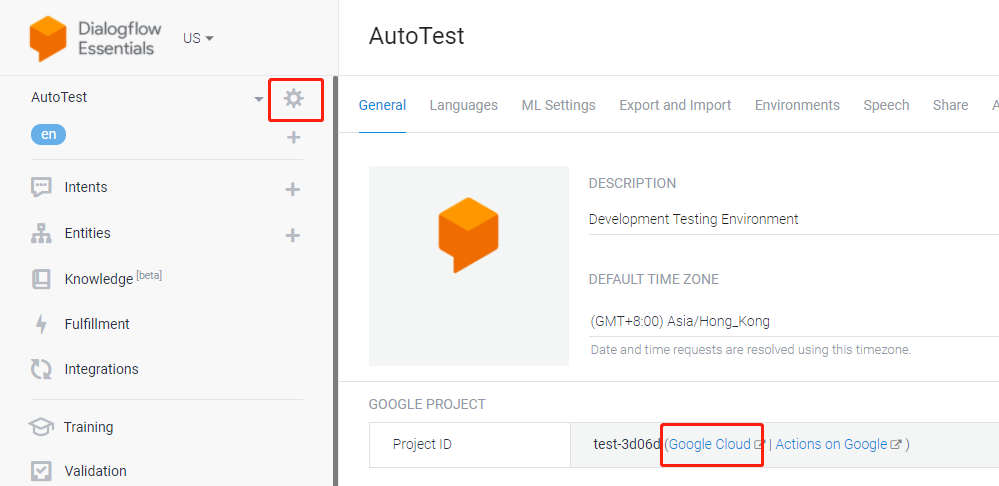
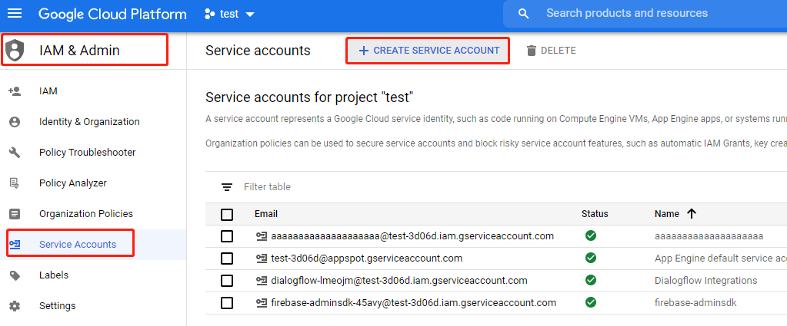
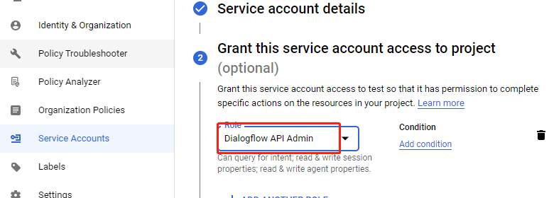
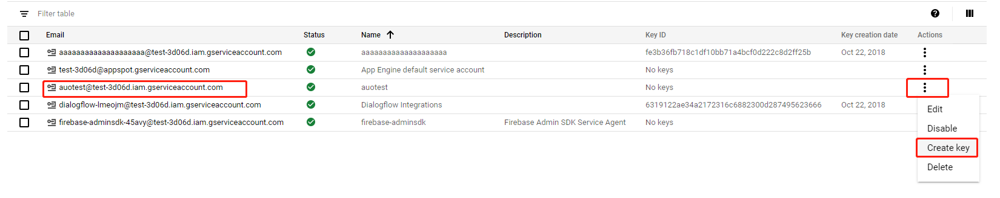

Service Account是应用直接与dialogflow进行通信的account，如果是普通用户
通过web网页操作，就可以叫web account之类的。

## 从Dialogflow Agent跳转到Google Cloud Console
首先进入[Dialogflow Console](https://dialogflow.cloud.google.com)，然后
进去设置面板，点击Google Cloud就可以跳转到对应Google Cloud Project Console
了，一个Dialogflow Agent对应一个Google Cloud Project，示例如下.

## 创建Service Account
进入如下菜单路径，IAM & Admin -> Service Accounts，然后点击Create Service Account，如示例

选择Dialogflow API Admin这个role，这样生成的key就有admin权限了，如示例

创建完Service Account后继续创建key，key就是一个json格式的文本文件，使用google提供的sdk与dialogflow通信时需要这个key文件来证明用户身份，在service account列表找到刚创建
的service account然后在右侧actions列表点Create Key，示例如下.

