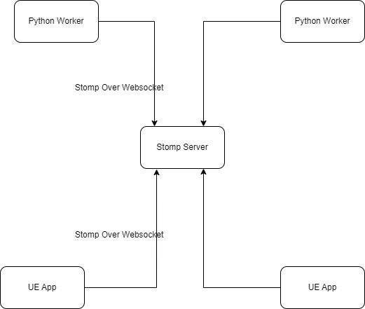

远程测试需要被测端提供RPC通信控制方式，比如rest over http，grpc等，因为UE本身
没有提供这种对外的控制接口，所以需要在应用层自己开发，又因为typescript的开发
效率比c++高，所以这里我们基于[puerts][]开了了简单的TS测试框架，
RPC机制为**[Stomp][] Over Websocket**

## 介绍

**代码位于[puerts_ue_test_demo][]**

基本流程是UE app和python worker都通过stomp连接到stomp服务器，然后两者通过这个通道通信，比如

- python worker请求UE app切换level
- python worker请求UE app执行测试
- UE app告诉python worker执行测试的结果

## python worker

在python侧我们封装了stomp client，然后通过它来驱动测试

## stomp server

stomp服务器可以选择rabbitmq，它支持stomp over websocket

<https://www.rabbitmq.com/stomp.html>

## UE app

在UE侧我们移植了
- [stompjs][]: 用作stomp client
- [text-encoding][]: 用作UTF8的编解码器，因为puerts的ts环境没有自带
- [BlueprintWebsockets][]: 在ts环境提供websocket实现

此外我们参照spring controller定义了简单的stomp controller，
来实现rpc endpoint的定义和加载

[puerts]: https://github.com/Tencent/puerts
[stompjs]: https://github.com/stomp-js/stompjs
[text-encoding]: https://github.com/inexorabletash/text-encoding/blob/master/lib/encoding.js
[BlueprintWebsockets]: https://github.com/minimpoun/BlueprintWebsockets
[stomp]: https://stomp.github.io/stomp-specification-1.2.html
[puerts_ue_test_demo]: https://github.com/colinzuo/puerts_ue_test_demo

