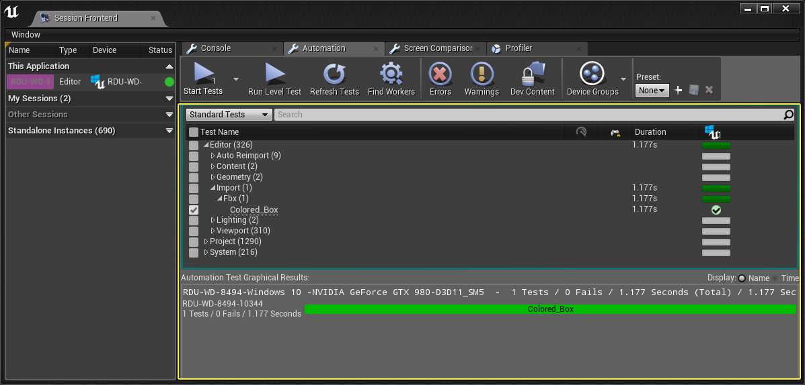

## UE原生测试

<https://docs.unrealengine.com/5.0/en-US/testing-and-optimizing-your-content//>

UE支持的测试大体分两类

### 普通C++的单元测试

<https://docs.unrealengine.com/5.0/en-US/automation-technical-guide/>

普通C++的单元测试，比如Datetime类的操作，不涉及
UObject系统，也就是不涉及蓝图等

```c++
	FDateTime::ParseIso8601(TEXT("2019-05-20T19:41:38+01:30"), ParsedDateTime);
	TestEqual(TEXT("Testing ISO 8601 with +hh:mm timezone info"), ParsedDateTime, FDateTime{ 2019, 5, 20, 18, 11, 38 });
	FDateTime::ParseIso8601(TEXT("2019-05-20T19:41:38-01:30"), ParsedDateTime);
	TestEqual(TEXT("Testing ISO 8601 with -hh:mm timezone info"), ParsedDateTime, FDateTime{ 2019, 5, 20, 21, 11, 38 });
```

### Functional测试

<https://docs.unrealengine.com/5.0/en-US/functional-testing-in-unreal-engine/>

Functional测试，是通过蓝图来测试，在Level蓝图中通过特定事件
OnTestStart触发，然后使用者使用蓝图来驱动流程并检查，按照检查
结果调用FinishTest来结束测试

也就是说每一个case需要有一个对应的map，中间不切换map，具体测试内容
可多可少看具体情况


### 测试执行

目前知道的是通过手动执行，通过 `Window > Developer Tools > Session Frontend`
启动Session Frontend，然后可以选择具体case，然后运行



### 培训视频

[Using Blueprint Interfaces to Reduce Coupling in Unreal Engine 4][]

[Automated functional testing in UE4][]

[Playtest While You SLEEP! Automated Testing in Unreal Engine 4](https://www.youtube.com/watch?v=528XSNTfxX8)

## 自研UE测试

外部测试执行器通过websocket与UE自研插件连接，然后发送控制消息驱动，发送查询消息
检查状态

与UE原生的Functional测试不同的是

- Functional测试每次都会重新启动map，也就是说状态cleanup是天然的，而自研的需要case自己
维护，比如在case开始前先去做setup工作，然后结束时做cleanup
- Functional测试只支持单一map，而自研的理论上各种事情都可以干，包括切换map
- Functional测试的case是写在蓝图里的，为了模块测试，依赖模块一般通过mock方式解耦，效率比较高
- 自研的case是在外部写的，但需要UE这边提供需要的控制和查询能力，各个模块都是实际的，非mock，
可以说是接近完全真实完整场景测试，但不同模块有依赖，可能效率会低


[Using Blueprint Interfaces to Reduce Coupling in Unreal Engine 4]: https://www.youtube.com/watch?v=JkJLeG8cErc&list=PLL4s8QTahRc11XP1Zn21F0v4CVD3abVKI&index=18
[Automated functional testing in UE4]: https://www.youtube.com/watch?v=HscEt4As0_g
