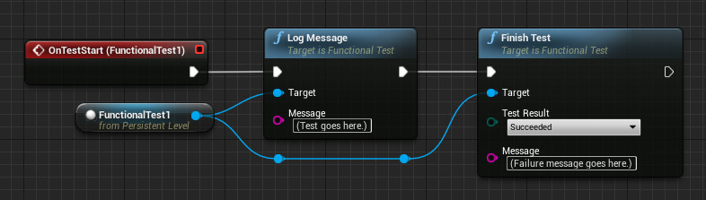

<https://docs.unrealengine.com/4.27/en-US/TestingAndOptimization/Automation/>

## Overview

### Unit Test

`Engine\Source\Runtime\Core\Private\Tests\Misc\TimespanTest.cpp`

```c++
	// constructors must create equal objects
	{
		FTimespan ts1_1 = FTimespan(3, 2, 1);
		FTimespan ts1_2 = FTimespan(0, 3, 2, 1);
		FTimespan ts1_3 = FTimespan(0, 3, 2, 1, 0);

		TestEqual(TEXT("Constructors must create equal objects (Hours/Minutes/Seconds vs. Days/Hours/Minutes/Seconds)"), ts1_1, ts1_2);
		TestEqual(TEXT("Constructors must create equal objects (Hours/Minutes/Seconds vs. Days/Hours/Minutes/Seconds/FractionNano)"), ts1_1, ts1_3);
	}
```

`Engine\Source\Runtime\Core\Private\Tests\Misc\DateTimeTest.cpp`

```c++
	FDateTime::ParseIso8601(TEXT("2019-05-20T19:41:38+01:30"), ParsedDateTime);
	TestEqual(TEXT("Testing ISO 8601 with +hh:mm timezone info"), ParsedDateTime, FDateTime{ 2019, 5, 20, 18, 11, 38 });
	FDateTime::ParseIso8601(TEXT("2019-05-20T19:41:38-01:30"), ParsedDateTime);
	TestEqual(TEXT("Testing ISO 8601 with -hh:mm timezone info"), ParsedDateTime, FDateTime{ 2019, 5, 20, 21, 11, 38 });
```

### Feature Test

`Engine\Plugins\Tests\EditorTests\Source\EditorTests\Private\UnrealEd\EditorAutomationTests.cpp`

都有**EditorContext**

```c++
/**
 * FGenericImportAssetsAutomationTest
 * Simple unit test that attempts to import every file (except .txt files) within the unit test directory in a sub-folder
 * named "GenericImport." Used to test the basic codepath that would execute if a user imported a file using the interface
 * in the Content Browser (does not allow for specific settings to be made per import factory). Cannot be run in a commandlet
 * as it executes code that routes through Slate UI.
 */
IMPLEMENT_COMPLEX_AUTOMATION_TEST(FGenericImportAssetsAutomationTest, "Editor.Import", (EAutomationTestFlags::EditorContext | EAutomationTestFlags::NonNullRHI | EAutomationTestFlags::EngineFilter))

/**
 * Pie Test
 * Verification PIE works
 */
IMPLEMENT_SIMPLE_AUTOMATION_TEST(FPIETest, "System.Maps.PIE", EAutomationTestFlags::EditorContext | EAutomationTestFlags::EngineFilter)
```

`Engine\Source\Runtime\Engine\Private\Tests\EngineAutomationTests.cpp`

都有**ClientContext**

```c++
/**
 * SetRes Verification - Verify changing resolution works
 */
IMPLEMENT_SIMPLE_AUTOMATION_TEST(FSetResTest, "System.Windows.Set Resolution", EAutomationTestFlags::ClientContext | EAutomationTestFlags::EngineFilter)

/**
 * Stats verification - Toggle various "stats" commands
 */
IMPLEMENT_SIMPLE_AUTOMATION_TEST(FStatsVerificationMapTest, "System.Maps.Stats Verification", EAutomationTestFlags::ClientContext | EAutomationTestFlags::EngineFilter)
```

## Automation Driver

An overview of the new Automation Driver feature, which enables programmers to **simulate user input**

The Automation Driver simulates input, which means that it can simulate cursor movement, clicks, pressing, typing, scrolling, drag-and-drop, and more

### How does it work

Within Core, there is a set of interfaces that **nearly all external input goes through**

### How do I use it

```c++
IAutomationDriverModule::Get().Enable();

//@todo simulate user behavior here

IAutomationDriverModule::Get().Disable();

FAutomationDriverPtr Driver = IAutomationDriverModule::Get().CreateDriver();

FDriverElementRef SignUpForm = Driver->FindElement(By::Id("Form"));
FDriverElementRef SubmitBtn = Driver->FindElement(By::Path("#Form//Submit"));

FDriverSequenceRef Sequence = Driver->CreateSequence();
Sequence->Actions()
    .Focus(SignUpForm)
    .Type(TEXT("FirstName\tLastName\tFirstName.LastName@example.com"))
    .Click(SubmitBtn);
Sequence->Perform();
```

## AutomationSpec

"Spec" is a term for a test that is built following the Behavior Driven Design (BDD) methodology

### How to Set up a Spec

```c++
DEFINE_SPEC(MyCustomSpec, "MyGame.MyCustomSpec", EAutomationTestFlags::ProductFilter | EAutomationTestFlags::ApplicationContextMask)
void MyCustomSpec::Define()
{
    //@todo write my expectations here
}
```

The only other callout is that you need to write the implementation for the Define() member of your Spec class, instead of the RunTests() member - as you would for any other test type.

Specs should be defined in a file with the .spec.cpp extension and not have the word "Test" in the name. For example, the FItemCatalogService class might have the files ItemCatalogService.h, ItemCatalogService.cpp, and ItemCatalogService.spec.cpp

### How to Define Your Expectations

A big part of BDD is that **instead of testing a specific implementation, you are testing expectations of a public API**.

#### Describe

```c++
void Describe(const FString& Description, TFunction<void()> DoWork)
```

You can cascade Describe() by putting a Describe() in another Describe()

Keep in mind that Describe() is not a test and is not executed during an actual test run. They are **only executed once when first defining the expectations** (or tests) within the Spec.

#### It

It() is the bit of code that defines an actual expectation for the Spec

Generally, it is a best practice to **start an It() call description string with the word "should"**, which implies "it should".

#### Defining a Basic Expectation

```c++
BEGIN_DEFINE_SPEC(MyCustomSpec, "MyGame.MyCustomClass", EAutomationTestFlags::ProductFilter | EAutomationTestFlags::ApplicationContextMask)
    TSharedPtr<FMyCustomClass> CustomClass;
END_DEFINE_SPEC(MyCustomSpec)
void MyCustomSpec::Define()
{
    Describe("Execute()", [this]()
    {
        It("should return true when successful", [this]()
        {
            TestTrue("Execute", CustomClass->Execute());
        });

        It("should return false when unsuccessful", [this]()
        {
            TestFalse("Execute", CustomClass->Execute());
        });
    });
}
```

Each of these It() calls becomes an individual test to be executed

#### How a Spec Expectation Translates to a Test

The Spec test type executes the **root Define() function once**, but not until it is needed. As this runs, it collects every non-Describe lambda. After the Define() finishes, it then goes back through all the lambdas or code blocks it collected, and generates an array of latent commands for each It().

Therefore, every BeforeEach(), It(), and AfterEach() lambda code block is **put together in a chain of execution for a single test**. When asked to run a specific test, the Spec test type will queue all the commands for that particular test for execution. When this happens, each block does not continue until the previous block has signaled it has finished executing.

#### Additional Features

- BeforeEach and AfterEach

```c++
BEGIN_DEFINE_SPEC(AutomationSpec, "System.Automation.Spec", EAutomationTestFlags::SmokeFilter | EAutomationTestFlags::ApplicationContextMask)
    FString RunOrder; 
END_DEFINE_SPEC(AutomationSpec)
void AutomationSpec::Define()
{
    Describe("A spec using BeforeEach and AfterEach", [this]()
    {
				BeforeEach([this]()
				{
						RunOrder = TEXT("A");
				});

				BeforeEach([this]()
				{
						RunOrder += TEXT("B");
				});

				It("will run code before each spec in the Describe and after each spec in the Describe", [this]()
				{
						TestEqual("RunOrder", RunOrder, TEXT("AB"));
				});

				AfterEach([this]()
				{
						RunOrder += TEXT("Y");
						TestEqual("RunOrder", RunOrder, TEXT("ABY"));
				});

				AfterEach([this]()
				{
						RunOrder += TEXT("Z");
						TestEqual("RunOrder", RunOrder, TEXT("ABYZ"));
				});
    });
}
```
- AsyncExecution

The Spec test type also enables you to easily define how a single code block should be executed. This is done by simply passing the appropriate **EAsyncExecution type** into the overloaded version of BeforeEach(), It(), and/or AfterEach()

```c++
BeforeEach(EAsyncExecution::TaskGraph, [this]() 
{
// set up some stuff
));

It("should do something awesome", EAsyncExecution::ThreadPool, [this]()
{
    // do some stuff
});

AfterEach(EAsyncExecution::Thread, [this]() 
{
    // tear down some stuff
));
```

- Latent Completion

```c++
LatentIt("should return available items", [this](const FDoneDelegate& Done)
{
    BackendService->QueryItems(this, &FMyCustomSpec::HandleQueryItemComplete, Done);
});

void FMyCustomSpec::HandleQueryItemsComplete(const TArray<FItem>& Items, FDoneDelegate Done)
{
    TestEqual("Items.Num() == 5", Items.Num(), 5);

    Done.Execute();
}
```

- Parameterized Tests

```c++
Describe("Basic Math", [this]()
{
    for (int32 Index = 0; Index < 5; Index++)
    {
        It(FString::Printf(TEXT("should resolve %d + %d = %d"), Index, 2, Index + 2), [this, Index]()
        {
            TestEqual(FString::Printf(TEXT("%d + %d = %d"), Index, 2, Index + 2), Index + 2, Index + 2);
        });
    }
});
```

## AutomationTestReportServer

`-ReportOutputPath=C:\http_server\local`

可以指定输出到特定目录，然后用http serve即可

## FunctionalTesting

### Creating a Test

Setting up a test is done by placing a **Functional Test Actor** in a Level. That Actor can then be scripted to run a set of tests by the **Level Script** in the **Level Blueprint**.



### Testing Via Child Class Method

If a Functional Test requires a more complex setup, or is intended to run multiple times (either in a single Level, or on multiple Levels), overriding AFunctionalTest is the **recommended method**

## TechnicalGuide

Automation Testing is the lowest level of automated testing, and is best suited for low-level tests of the core functionality of the Engine. This system exists **outside of the UObject ecosystem**, so it is not visible to Blueprints or the Engine's Reflection System.

Automation Tests can be broken into two types: **Simple and Complex**. Both types are implemented as derived classes based on FAutomationTestBase.

### Creating a New Automation Test

Simple Tests are declared using the **IMPLEMENT_SIMPLE_AUTOMATION_TEST** macro, while Complex Tests require the **IMPLEMENT_COMPLEX_AUTOMATION_TEST** macro.

- TClass: The desired class name of the test. The macro will create a class of this name, e.g. FPlaceholderTest
- PrettyName: A string specifying the hierarchical test name that will appear in the UI
- TFlags: A combination of EAutomationTestFlags values, used for specifying Automation Test requirements and behaviors

- RunTest: This function performs the **actual test**, returning true to indicate that the test passed, or false to indicate that it failed.
- GetTests: This function must be overridden for **Complex Tests only**; Simple Tests have an auto-generated version of this function built into their declaration macro.
  + OutTestCommands: This array of strings is expected to be parallel to OutBeautifiedNames and must be populated with the Parameters to be passed into RunTest

#### Source File Locations

The current convention is to put all Automation Tests into the **Private\Tests** directory within the relevant module. When an Automation Test matches one-to-one with a particular class, please name the test file **[ClassFilename]Test.cpp**

### Simple Tests

Simple Tests are used to describe single **atomic tests**, and are useful as **unit or feature** tests. For example, simple tests can be used to test if the current **map loads in Play In Editor** or whether text wrapping is working properly in Slate

```c++
IMPLEMENT_SIMPLE_AUTOMATION_TEST( FSetResTest, "Windows.SetResolution", ATF_Game )

bool FSetResTest::RunTest(const FString& Parameters)
{
    FString MapName = TEXT("AutomationTest");
    FEngineAutomationTestUtilities::LoadMap(MapName);

    int32 ResX = GSystemSettings.ResX;
    int32 ResY = GSystemSettings.ResY;
    FString RestoreResolutionString = FString::Printf(TEXT("setres %dx%d"), ResX, ResY);

    ADD_LATENT_AUTOMATION_COMMAND(FEngineWaitLatentCommand(2.0f));
    ADD_LATENT_AUTOMATION_COMMAND(FExecStringLatentCommand(TEXT("setres 640x480")));
    ADD_LATENT_AUTOMATION_COMMAND(FEngineWaitLatentCommand(2.0f));
    ADD_LATENT_AUTOMATION_COMMAND(FExecStringLatentCommand(RestoreResolutionString));

    return true;
}
```

### Complex Tests

```c++
IMPLEMENT_COMPLEX_AUTOMATION_TEST(FLoadAllMapsInGameTest, "Maps.LoadAllInGame", ATF_Game)

void FLoadAllMapsInGameTest::GetTests(TArray<FString>& OutBeautifiedNames, TArray <FString>& OutTestCommands) const
{
    FEngineAutomationTestUtilities Utils;
    TArray<FString> FileList;
    FileList = GPackageFileCache->GetPackageFileList();

    // Iterate over all files, adding the ones with the map extension..
    for( int32 FileIndex=0; FileIndex< FileList.Num(); FileIndex++ )
    {
        const FString& Filename = FileList[FileIndex];

        // Disregard filenames that don't have the map extension if we're in MAPSONLY mode.
        if ( FPaths::GetExtension(Filename, true) == FPackageName::GetMapPackageExtension() ) 
        {
            if (!Utils.ShouldExcludeDueToPath(Filename))
            {
                OutBeautifiedNames.Add(FPaths::GetBaseFilename(Filename));
                OutTestCommands.Add(Filename);
            }
        }
    }
}

bool FLoadAllMapsInGameTest::RunTest(const FString& Parameters)
{
    FString MapName = Parameters;

    FEngineAutomationTestUtilities::LoadMap(MapName);
    ADD_LATENT_AUTOMATION_COMMAND(FEnqueuePerformanceCaptureCommands());

    return true;
}
```

### Latent Commands

Latent Commands can be queued up during RunTest, causing sections of the code to **run across multiple frames**

```c++
DEFINE_LATENT_AUTOMATION_COMMAND(FNUTWaitForUnitTests);

bool FNUTWaitForUnitTests::Update()
{
    return GUnitTestManager == NULL || !GUnitTestManager->IsRunningUnitTests();
}
```

When the Update function returns true, the Latent Command is considered complete. A return **value of false** indicates that the Automation Test should stop executing immediately and **try again next frame**

## UserGuide

The **Automation tab** is part of the Session (Unreal) Frontend. It's located here because it enables you to run automation tests on **any other devices that are connected to your machine or are on your local network**.
